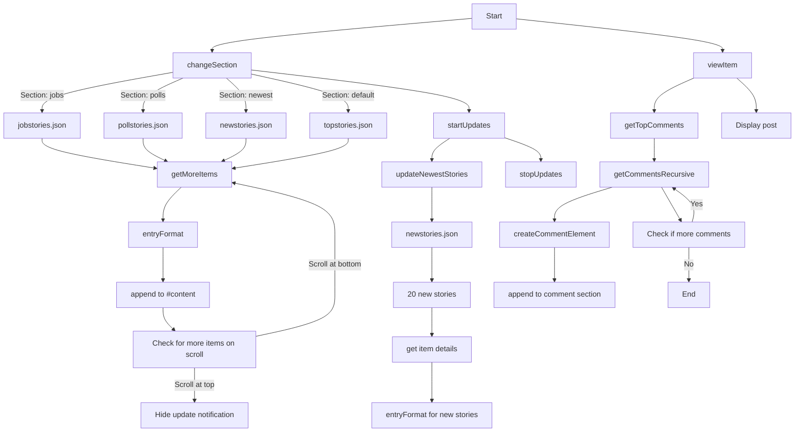

# Hacker News Clone

A dynamic, single-page web application that replicates core functionalities of Hacker News, built with JavaScript and jQuery.

## Table of Contents

- [Introduction](#introduction)
- [Features](#features)
- [Technical Overview](#technical-overview)
- [Key Functions](#key-functions)
- [Usage](#usage)
- [API Integration](#api-integration)
- [Performance Optimizations](#performance-optimizations)
- [Future Enhancements](#future-enhancements)
- [Contributors](#contributors)

## Introduction

This project is a feature-rich Hacker News clone that leverages the official Hacker News API to provide users with a seamless browsing experience. It offers real-time updates, comment threading, and section-based content organization.

## Features

- Browse multiple content sections: Top Stories, Newest Stories, Jobs, and Polls
- Real-time updates for the Newest Stories section
- Infinite scrolling for continuous content loading
- Detailed view for individual posts with threaded comments
- Dynamic URL updates for easy sharing and navigation
- Responsive design for optimal viewing across devices

## Technical Overview

The application is built entirely in JavaScript, utilizing jQuery for DOM manipulation and AJAX requests. It interacts with the Hacker News API to fetch and display content dynamically.

# Hacker News Clone

[... Previous content ...]

## Application Flow



## Key Functions

1. `changeSection(section)`: Switches between different content sections, updating the UI and fetching relevant data.
2. `getMoreItems(topItems, offset)`: Implements infinite scrolling by fetching additional items as the user scrolls.
3. `viewItem(item)`: Displays a detailed view of a single post, including its comments.
4. `getTopComments(item)` and `getCommentsRecursive(commentIds, parentElement)`: Fetch and display threaded comments for a post.
5. `updateNewestStories()`: Periodically checks for and displays new stories in the Newest section.

## Usage

The application initializes by loading the Top Stories section:

```javascript
changeSection('stories');
```

Users can navigate between sections using the navbar, view individual posts, and scroll to load more content.

## API Integration

The application integrates with the Hacker News API (https://hacker-news.firebaseio.com/v0) to fetch story IDs and item details. It uses jQuery's AJAX functionality for all API calls.

## Performance Optimizations

- Throttled scroll event handling to prevent excessive function calls
- Delayed content reveal to ensure smooth loading transitions
- Efficient comment fetching using recursive promises

## Future Enhancements

- User authentication and personalized content
- Ability to post comments and stories
- Advanced sorting and filtering options
- Offline support and caching

## Contributors

- Bravian Nyatoro
- Antony Oduor
- Hezron Okwach

This project showcases advanced JavaScript techniques, efficient API integration, and thoughtful user experience design.
